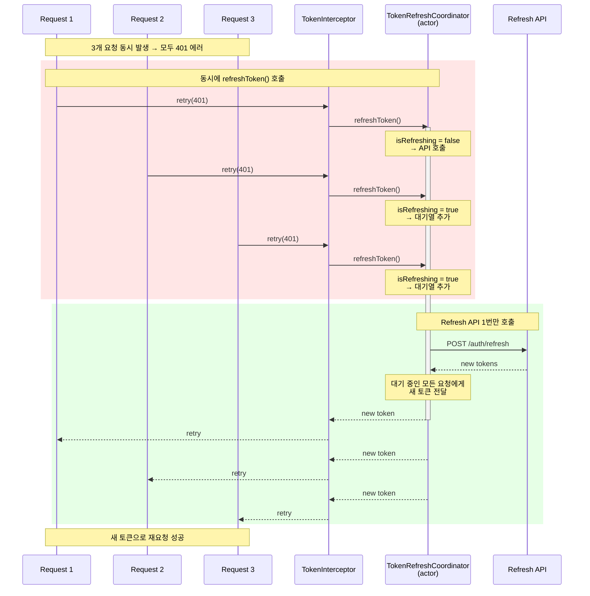

# FlatBread

> 위치 기반 소셜 모임(MOIM) iOS 애플리케이션

FlatBread는 사용자가 관심사를 공유하는 사람들과 모임을 만들고, 실시간 채팅, 숏폼 비디오, 그리고 위치 기반 발견 기능을 통해 연결될 수 있는 SwiftUI 기반 iOS 앱입니다.


## 목차

- [주요 기능](#주요-기능)
- [아키텍처](#아키텍처)
- [기술 스택](#기술-스택)
- [프로젝트 구조](#프로젝트-구조)
- [핵심 구현](#핵심-구현)
- [설치 및 실행](#설치-및-실행)

---

## 주요 기능

### 인증 (Auth)
- 이메일/비밀번호 로그인 및 회원가입
- Apple Sign-In 소셜 로그인
- 자동 로그인 (토큰 갱신)
- 입력 검증 (이메일, 비밀번호 형식)

### 홈 (Home)
- 배너 캐러셀 (최근 게시물 기반)
- 18개 카테고리별 모임 필터링
- 모임 카드 (멤버 수, 카테고리 표시)
- 카테고리 상세 페이지네이션
- Pull-to-Refresh

### 실시간 채팅 (Chat)
- WebSocket 기반 실시간 메시징
- Realm 로컬 DB를 통한 오프라인 지원
- 텍스트, 이미지, 파일 메시지 전송
- 읽음 확인 및 메시지 상태
- 메시지 페이지네이션
- 스마트 프로필/타임스탬프 표시

### 지도 기반 발견 (Map)
- Naver Maps 통합
- 실시간 위치 추적
- 모임 마커 표시
- 카테고리별 필터링
- 주변 모임 카드 캐러셀
- 현재 위치로 카메라 이동 애니메이션

### 게시글 및 일정 (Post)
- 게시글 작성, 수정, 삭제
- 댓글 시스템 (중첩 지원)
- 일정 관리 및 캘린더 피커
- 좋아요/좋아요 취소
- 멤버 카드 프로필
- 게시글 페이지네이션

### 프로필 (Profile)
- 사용자 프로필 조회 및 편집
- 프로필 이미지 업로드
- 통계 표시
- 내 프로필 vs 타인 프로필 모드

### 모임 생성 (CreateMoim)
- 지역/위치 선택
- 카테고리 선택 (칩 UI)
- 지도 기반 위치 피커
- 지역 검색

### 내 모임 (Moim)
- 가입한 모임 목록
- 추천 모임
- 멤버 수 및 카테고리 표시
- Empty State 처리

### 숏폼 비디오 (ShortVideo)
- TikTok 스타일 세로 스크롤 피드
- 비디오 플레이어 (메모리/디스크 캐싱)
- 좋아요/즐겨찾기
- 댓글 시스템
- 커스텀 리소스 로더를 통한 비디오 스트리밍
- 스마트 프리로딩 (다음 영상: 메모리, 이전 영상: 디스크)

### 비디오 업로드 (UploadShortVideo)
- 라이브러리에서 비디오 선택
- 업로드 진행률 표시
- 비디오 메타데이터 처리

### 주변 사용자 찾기 (SearchNearby)
- MultipeerConnectivity를 사용한 로컬 피어 발견
- 레이더 시각화 (거리 원)
- 연결 요청/수락 플로우
- 인터넷 없이 동작
- 익명성을 위한 닉네임 생성

### 결제 (Payment)
- Iamport 한국 결제 게이트웨이 통합
- 결제 검증
- 결제 내역

### 온보딩 (Onboarding)
- 초기 사용자 설정
- 단계별 온보딩 플로우

### 📂 카테고리 상세 (HomeCategoryDetail)
- 단일 카테고리의 모임 목록
- 페이지네이션 지원

---

## 아키텍처

FlatBread는 **MVVM (Model-View-ViewModel)과 Clean Architecture 원칙**을 따릅니다.

### 아키텍처 패턴

```
┌─────────────────────────────────────────────────────────────┐
│                         View (SwiftUI)                       │
│  - 선언적 UI                                                 │
│  - @StateObject, @ObservedObject, @Published 바인딩          │
└───────────────────────────┬─────────────────────────────────┘
                            │
                            ▼
┌─────────────────────────────────────────────────────────────┐
│                   ViewModel (ObservableObject)               │
│  - Presentation Logic                                        │
│  - @Published 속성                                           │
│  - 서비스 의존성 주입                                        │
└───────────────────────────┬─────────────────────────────────┘
                            │
                            ▼
┌─────────────────────────────────────────────────────────────┐
│                      Services Layer                          │
│  - Business Logic                                            │
│  - NetworkService, ChatService, LocationManager 등           │
└───────────────────────────┬─────────────────────────────────┘
                            │
                ┌───────────┴──────────┐
                ▼                      ▼
┌──────────────────────┐   ┌──────────────────────┐
│   Network Layer      │   │  Persistence Layer   │
│  - Alamofire         │   │  - Realm             │
│  - Router Pattern    │   │  - UserDefaults      │
│  - Interceptors      │   │  - Repository        │
└──────────────────────┘   └──────────────────────┘
```

### 디렉토리 구조

```
Features/
├── [Feature]/
    ├── Presentation/
    │   ├── View/          # SwiftUI Views
    │   ├── ViewModel/     # ObservableObject ViewModels
    │   ├── Components/    # 재사용 가능한 UI 컴포넌트
    │   └── Model/         # Presentation용 UI 모델
    └── Data/              # 데이터 매핑 레이어 (선택적)

Core/
├── Network/               # 네트워크 레이어 (DTOs, Routers)
├── Persistence/           # Realm + UserDefaults
├── Services/              # 비즈니스 로직 서비스
├── DeepLinking/           # 내비게이션 라우팅
├── Extensions/            # 유틸리티 익스텐션
└── Utilities/             # 헬퍼 클래스
```

### 핵심 아키텍처 패턴

1. **MVVM 패턴**: 모든 ViewModel은 `ObservableObject`를 상속하고 `@Published` 속성 사용
2. **의존성 주입**: 팩토리 또는 프로퍼티 주입을 통한 서비스 주입
3. **서비스 레이어**: Network, Chat, Location, FCM, ImageDownload 서비스 중앙화
4. **Repository 패턴**: `ChatMessageRepository`, `ChatRoomRepository`를 통한 데이터 접근
5. **Router 패턴**: APIRouter 프로토콜 기반 네트워크 엔드포인트
6. **Actor 패턴**: `TokenRefreshCoordinator`와 `DefaultTokenStorage`에서 스레드 안전성을 위해 Swift Actor 사용
7. **데이터 플로우**: Views → ViewModels → Services → Network/Persistence

---

## 기술 스택

### 핵심 프레임워크

| 기술 | 용도 |
|------|------|
| **SwiftUI** | 선언적 UI 프레임워크 (iOS 15+) |
| **Combine** | 리액티브 프로그래밍 (Publisher/Subscriber) |
| **Async/Await** | 현대적 동시성 처리 (Swift 5.5+) |
| **Actors** | 스레드 안전 상태 관리 |

### 네트워킹

| 라이브러리 | 용도 |
|-----------|------|
| **Alamofire** | HTTP 네트워킹 레이어 |
| **Custom Router** | 프로토콜 기반 API 라우터 (Parameter, Multipart, Download, VideoStream) |
| **WebSocket** | 실시간 채팅 통신 |

### 인증 및 보안

- **TokenRefreshCoordinator**: Actor 기반 동시 토큰 갱신
- **TokenInterceptor**: 자동 토큰 주입 및 401 갱신
- **Apple Sign-In**: AuthenticationServices 프레임워크
- **TokenStorage**: Actor 기반 async/await 스토리지

### 데이터 저장

| 기술 | 용도 |
|------|------|
| **Realm** | 채팅 메시지 및 룸 로컬 DB |
| **UserDefaults** | 토큰 및 세션 데이터 |
| **FileManager** | 이미지 파일 관리 |

### 실시간 통신

| 기술 | 용도 |
|------|------|
| **WebSocket** | 채팅 실시간 메시징 |
| **MultipeerConnectivity** | 로컬 피어 발견 (SearchNearby) |

### 이미지 및 미디어

| 라이브러리 | 용도 |
|-----------|------|
| **Kingfisher** | 이미지 캐싱 및 다운로드 |
| **HWImageService** | 메모리/디스크 캐싱 전략 래퍼 |
| **AVFoundation** | 비디오 재생 |
| **커스텀 비디오 캐싱** | 3단계 캐싱 (Memory → Current, Disk → Previous) |

### 지도

| 기술 | 용도 |
|------|------|
| **Naver Maps (NMapsMap)** | 위치 기반 서비스 |
| **Core Location** | 사용자 위치 추적 |

### 푸시 알림 및 분석

| 기술 | 용도 |
|------|------|
| **Firebase Cloud Messaging (FCM)** | 푸시 알림 |
| **Firebase Core** | 분석 및 인프라 |
| **FCMManager** | FCM 토큰 및 알림 처리 중앙화 |

### 결제

| 라이브러리 | 용도 |
|-----------|------|
| **Iamport iOS** | 한국 결제 게이트웨이 통합 |

### 외부 의존성 전체 목록

```
- Alamofire
- Kingfisher
- Realm
- NMapsMap
- Firebase (Core, Messaging, Functions)
- iamport_ios
- AuthenticationServices
- MultipeerConnectivity
- AVFoundation
- HwanCache (커스텀 이미지 캐싱)
```

---

## 프로젝트 구조

```
FlatBread/
├── FlatBread/
│   ├── App/                          # 앱 진입점
│   │   ├── FlatBreadApp.swift        # @main 진입점
│   │   ├── AppDelegate.swift         # Firebase, FCM, Payment 설정
│   │   └── ContentView.swift         # 루트 네비게이션
│   │
│   ├── Features/                     # 기능 모듈 (MVVM)
│   │   ├── Auth/                     # 로그인/회원가입
│   │   ├── Chat/                     # 실시간 메시징
│   │   ├── Home/                     # 피드 및 배너
│   │   ├── Map/                      # 위치 기반 발견
│   │   ├── Post/                     # 게시글 및 댓글
│   │   ├── Profile/                  # 사용자 프로필
│   │   ├── CreateMoim/               # 모임 생성
│   │   ├── Moim/                     # 내 모임
│   │   ├── Payment/                  # 결제 처리
│   │   ├── ShortVideo/               # TikTok 스타일 피드
│   │   ├── UploadShortVideo/         # 비디오 업로드
│   │   ├── SearchNearby/             # 피어 발견
│   │   ├── ShortVideoComment/        # 비디오 댓글
│   │   ├── Onboarding/               # 초기 설정
│   │   └── HomeCategoryDetail/       # 카테고리 상세
│   │
│   ├── Core/                         # 공유 인프라
│   │   ├── Network/                  # HTTP 및 WebSocket
│   │   │   ├── Services/             # NetworkService, Interceptors
│   │   │   ├── Protocols/            # APIRouter 등
│   │   │   ├── Helper/               # APIConfig, APIHeader
│   │   │   ├── Post/                 # 게시글 DTOs
│   │   │   ├── Chat/                 # 채팅 DTOs
│   │   │   ├── User/                 # 사용자 DTOs
│   │   │   ├── MultipartRouter/      # 파일 업로드
│   │   │   ├── PaymentRouter/        # 결제 DTOs
│   │   │   └── SingleRouter/         # 토큰 갱신
│   │   │
│   │   ├── Persistence/              # Realm + UserDefaults
│   │   │   ├── ChatMessageRepository
│   │   │   ├── ChatRoomRepository
│   │   │   ├── TokenStorage          # Actor 기반
│   │   │   └── UserSession           # 싱글톤
│   │   │
│   │   ├── Services/                 # 비즈니스 로직
│   │   │   ├── ChatService
│   │   │   ├── ChatSyncManager
│   │   │   ├── ChatWebSocketManager
│   │   │   ├── FCMManager
│   │   │   ├── LocationManager
│   │   │   ├── ImageService
│   │   │   └── UserCache
│   │   │
│   │   ├── DeepLinking/              # 네비게이션 라우팅
│   │   ├── Extensions/               # Date, DTO 매퍼
│   │   └── Utilities/                # 파일 매니저, 헬퍼
│   │
│   ├── DesignSystem/                 # 재사용 가능한 UI 컴포넌트
│   │   ├── Components/
│   │   ├── Modifiers/
│   │   └── Styles/
│   │
│   ├── Shared/                       # 공유 모델 및 유틸리티
│   │   ├── Models/
│   │   ├── Protocols/
│   │   ├── Mappers/
│   │   └── Errors/
│   │
│   ├── Resources/                    # Assets, 문자열, 색상
│   ├── Configs/                      # 빌드 설정
│   └── FlatBread.entitlements        # 앱 권한
│
├── FlatBreadTests/                   # 유닛 테스트
│   ├── Tests/
│   │   └── NetworkTests/
│   │       ├── TokenInterceptorTests
│   │       ├── TokenRefreshCoordinatorTests
│   │       └── Router Tests
│   └── Mocks/
│       ├── MockTokenStorage
│       ├── MockSessionFactory
│       └── MockURLProtocol
│
└── FlatBread.xcodeproj/              # Xcode 프로젝트
```

---

## 핵심 구현

### 1. TokenRefreshCoordinator - Actor 패턴

동시 요청 시 토큰 갱신을 **단 1번만** 수행하도록 보장하는 스레드 안전 구현입니다.

```swift
actor TokenRefreshCoordinator {
    private var isRefreshing = false
    private var waitingContinuations: [CheckedContinuation<String, Error>] = []

    func refreshToken() async throws -> String {
        // 이미 갱신 중이면 대기열에 추가
        if isRefreshing {
            return try await withCheckedThrowingContinuation { continuation in
                waitingContinuations.append(continuation)
            }
        }

        isRefreshing = true

        do {
            let token = try await performRefresh()

            // 대기 중인 모든 요청에게 새 토큰 전달
            let waiters = waitingContinuations
            waitingContinuations.removeAll()
            isRefreshing = false

            for continuation in waiters {
                continuation.resume(returning: token)
            }

            return token
        } catch {
            // 에러 시 모든 대기 요청에게 에러 전파
            let waiters = waitingContinuations
            waitingContinuations.removeAll()
            isRefreshing = false

            for continuation in waiters {
                continuation.resume(throwing: error)
            }

            throw error
        }
    }
}
```

**시퀀스 다이어그램**:



**핵심 포인트**:
- Actor를 사용하여 동시성 문제 해결
- Continuation 기반 대기 메커니즘
- 3개의 동시 요청이 와도 실제 API는 1번만 호출
- 모든 대기 요청에게 결과 일괄 전달

### 2. 채팅 메시지 동기화 (WebSocket + Realm)

실시간 메시징과 오프라인 지원을 모두 제공하는 하이브리드 아키텍처입니다.

```swift
class ChatSyncManager {
    private let webSocketManager: ChatWebSocketManager
    private let repository: ChatMessageRepository
    private var messageQueue: [Message] = []

    func loadMessages() async {
        // 1. Realm에서 로컬 메시지 로드
        let localMessages = await repository.loadMessages()

        // 2. WebSocket 연결 및 실시간 메시지 수신
        webSocketManager.connect()

        // 3. 큐에 쌓인 메시지 처리
        processQueuedMessages()
    }

    private func processQueuedMessages() {
        for message in messageQueue {
            // 중복 체크 후 추가
            if !isDuplicate(message) {
                repository.save(message)
            }
        }
        messageQueue.removeAll()
    }
}
```

**특징**:
- Realm: 오프라인 메시지 저장
- WebSocket: 실시간 메시지 수신
- 큐 관리: Realm 동기화 완료까지 메시지 대기
- 중복 방지: 메시지 ID 기반 체크

### 3. 고급 비디오 캐싱 시스템

3단계 캐싱 전략으로 부드러운 비디오 재생을 보장합니다.

```
┌─────────────────────────────────────────────┐
│         Video Caching Strategy              │
├─────────────────────────────────────────────┤
│  Current Video (Playing)                    │
│  ↓                                          │
│  [Memory Cache] ← ShortVideoMemoryPreloader │
│                                             │
│  Next Video (Preload)                       │
│  ↓                                          │
│  [Memory Cache] ← Load to memory            │
│                                             │
│  Previous Videos                            │
│  ↓                                          │
│  [Disk Cache] ← ShortVideoDiskPreloader     │
└─────────────────────────────────────────────┘
```

**구현**:
- **Memory Cache**: 현재 및 다음 비디오
- **Disk Cache**: 이전 비디오들
- **Custom Resource Loader**: AVPlayer 통합
- **Smart Preloading**: 스크롤 방향에 따라 동적 프리로드

### 4. 네트워크 레이어 아키텍처

프로토콜 기반의 유연한 네트워크 레이어입니다.

```swift
// Base Router Protocol
protocol APIRouter: URLRequestConvertible {
    var baseURL: URL { get }
    var method: HTTPMethod { get }
    var path: String { get }
    var headers: HTTPHeaders { get }
}

// Specialized Router Protocols
protocol MultipartAPIRouter: APIRouter      // 파일 업로드
protocol DownloadAPIRouter: APIRouter       // 파일 다운로드
protocol ParameterAPIRouter: APIRouter      // Query/Body 파라미터
protocol VideoStreamableRouter: APIRouter   // 비디오 스트리밍

// Service Protocol
protocol AsyncNetworkService {
    func request<T: Decodable & Sendable>(
        _ router: APIRouter
    ) async throws(NetworkError) -> T

    func upload<T: Decodable & Sendable>(
        _ router: MultipartAPIRouter
    ) async throws(NetworkError) -> T

    func download(
        _ router: DownloadAPIRouter
    ) async throws(NetworkError) -> URL
}
```

**Interceptor 타입**:
```swift
enum InterceptorType {
    case networkWithToken        // 토큰 + 재시도
    case onlyNetworkRetrier      // 재시도만
    case noInterceptor           // 없음
}
```

### 5. MultipeerConnectivity 기반 근처 사용자 찾기

인터넷 없이 근처 사용자를 발견하는 기능입니다.

```swift
class NearbyService: NSObject {
    private let serviceType = "flatbread-peer"
    private var advertiser: MCNearbyServiceAdvertiser
    private var browser: MCNearbyServiceBrowser

    func startAdvertising() {
        // 자신을 근처 피어에게 광고
        advertiser.startAdvertisingPeer()
    }

    func startBrowsing() {
        // 근처 피어 검색
        browser.startBrowsingForPeers()
    }

    func invitePeer(_ peerID: MCPeerID) {
        // 연결 요청 전송
        browser.invitePeer(peerID, to: session, withContext: nil, timeout: 30)
    }
}
```

**특징**:
- 로컬 네트워크만 사용 (인터넷 불필요)
- 레이더 UI로 거리 시각화
- 초대/수락 플로우
- 익명 닉네임 생성

### 6. FCM 토큰 관리

효율적인 푸시 알림 토큰 관리입니다.

```swift
class FCMManager {
    private var pendingToken: String?

    func updateFCMToken() async {
        guard let token = await getFCMToken() else { return }

        // 토큰 변경 감지 (불필요한 API 호출 방지)
        if token != UserDefaults.lastFCMToken {
            await sendTokenToServer(token)
            UserDefaults.lastFCMToken = token
        }
    }

    func handlePendingToken() async {
        // 로그인 후 대기 중인 토큰 전송
        if let token = pendingToken {
            await sendTokenToServer(token)
            pendingToken = nil
        }
    }
}
```

### 7. 딥링크 라우팅

앱 상태를 고려한 스마트 딥링크 처리입니다.

```swift
class DeepLinkManager {
    func handleDeepLink(_ url: URL) {
        let appState = UIApplication.shared.applicationState

        switch appState {
        case .active:
            // 즉시 라우팅
            route(to: url)

        case .background, .inactive:
            // 앱 활성화 후 라우팅
            NotificationCenter.default.post(
                name: .delayedDeepLink,
                object: url
            )

        @unknown default:
            break
        }
    }
}
```

---

## 설치 및 실행

### 요구사항

- Xcode 15.0+
- iOS 17.0+
- Swift 5.9+
- CocoaPods 또는 Swift Package Manager

### 테스트 실행

```bash
# 유닛 테스트
xcodebuild test -project FlatBread.xcodeproj -scheme FlatBread -destination 'platform=iOS Simulator,name=iPhone 15'

# 또는 Xcode에서
# Command + U
```

---

## 주요 아키텍처 결정 사항

1. **Actor 기반 토큰 관리**: 동시 토큰 갱신에서 경쟁 조건 방지
2. **프로토콜 주도 네트워킹**: 다양한 API 호출 패턴을 위한 유연한 라우터 타입
3. **WebSocket + Realm 채팅**: 실시간 동기화와 오프라인 지원
4. **3단계 비디오 캐싱**: 최적 성능을 위해 Memory→현재, Disk→이전
5. **Environment 주입 서비스**: SwiftUI 모범 사례를 따른 의존성 주입
6. **앱 상태 인식 딥링크**: 포그라운드/백그라운드 알림 적절한 처리
7. **Continuation 기반 동시 요청 큐잉**: 여러 동시 API 호출에 대한 비차단 토큰 갱신
8. **MultipeerConnectivity**: 인터넷 없이 로컬 발견 (SearchNearby)

---

## 라이선스

이 프로젝트의 라이선스는 별도로 명시되지 않았습니다.

---

## 기여

기여는 환영합니다! Pull Request를 제출하거나 Issue를 열어주세요.

---

## 연락처

프로젝트 관련 문의: [GitHub Issues](https://github.com/TheGreatFlatBread/FlatBread/issues)
